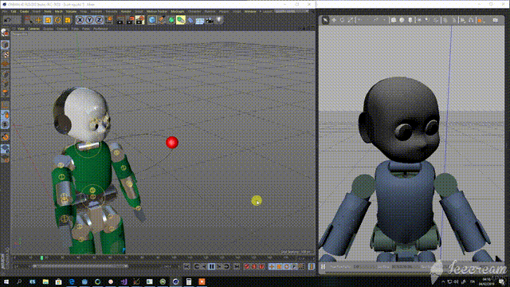
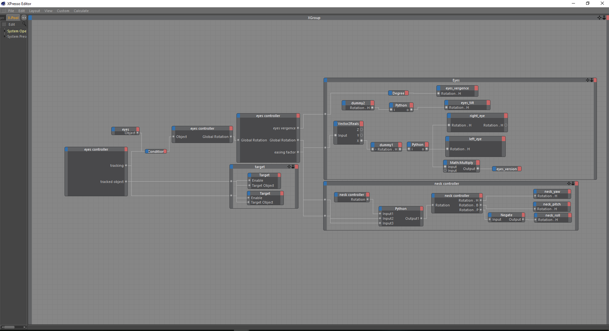

# CG plugins
This repository contains utilities for exporting/controlling your robot in CG animation environments such as [Blender](https://www.blender.org/) or [Cinema4D](https://www.maxon.net/en/cinema-4d)(unmaintained)

## Maintainers
This repository is maintained by:

| | |
|:---:|:---:|
| [](https://github.com/niNicogenecogene) | [@Nicogene](https://github.com/Nicogene) |

## Blender
### urdfToBlender
Python script that given the urdf of a robot as input, define the complete rig, in terms of bones, meshes and joint limits.
#### Dependencies
- Blender > 2.79
- iDynTree python bindings
- `GAZEBO_MODEL_PATH` pointing to the folder containing the urdfs and meshes of the models to be converted.

#### Usage
Once installed correctly the dependencies run:
(Windows Powershell)
```
 & "C:\Program Files\Blender Foundation\Blender <blender_version>\blender.exe" --python-use-system-env
```
(Linux)
```
$ blender --python-use-system-env
```

Go to "Scripting" section, open `urdfToBlender`, then run.
It will open a dialog for selecting the urdf to be converted to rig.


After selecting the urdf, the script creates the rig of the robot in term of armature and meshes.

#### Examples
**iCub 2.5**
**iCub 3**

#### Known limitations
- Only fixed or revolute joints are handled(see ).
- Only `.stl` and `.ply` format are supported for meshes.

### blenderController 🚧
Simple demo script that opens a [YARP `remote_controlboard`] for controlling the iCub head, and attach to the animations frames a callback for moving the joints accordingly to the movements of the rig.
Since it is script that has been created with the purpose to show the potentialities of Blender in robotics, this will be not improved/extended or maintained.
Here is a gif showing this simple controller on iCub.

### blenderRCBPanel 🚧
WORK IN PROGRESS

## Cinema4D (UNMAINTAINED)
plugins library for integrating icub platform and the cg animation software Cinema4D. useful for scripting complex animation,
prototyping application and dataflow programming.
plugin developed:
- remotecontrolboard: connect with a part of the robot and exposes inside cinema4d some objects input (as many as the part joint count)
to be filled with the object whom rotation will be used to control the joint.
- sdf importer: very rough python script to import the kinematic and the visual model of a sdf inside cinema4d.

the following is an example of a realtime application, working with gazebo, that makes the eyes and
the neck of icub following a virtual redball. only the redball is being animated/moved. all the neck and eyes movement are
implemented via the tools avaiable in cinema4d and sended to the robot via the remotecontrolboard plugin


this is the xpresso schema that do the magic.

